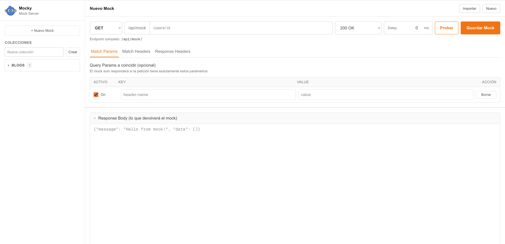
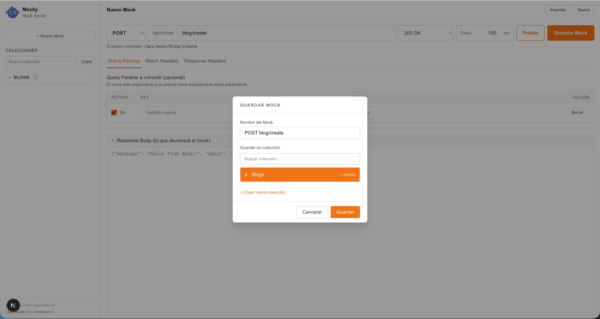
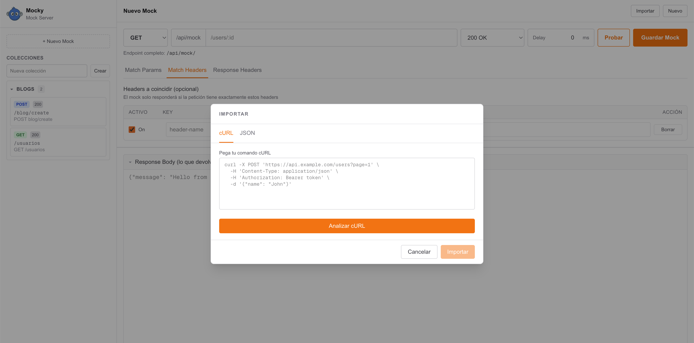
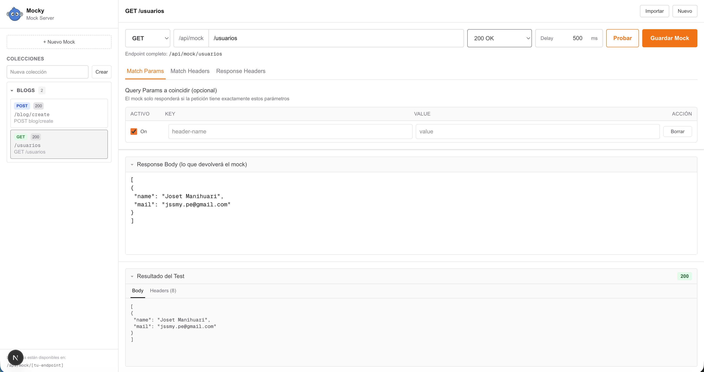

<p align="center">
  
</p>

# Mocky

**Mocky** es un servidor de mocks local inspirado en [Postman](https://www.postman.com/), diseñado para que los equipos de frontend puedan simular APIs REST de forma rápida y sin depender del backend. Organiza tus endpoints en colecciones, configura respuestas personalizadas y prueba tus peticiones en tiempo real.

> **Versión:** 1.0.0

---

## 📸 Capturas de pantalla









---

## ✨ Características

- 📁 **Colecciones**: organiza tus mocks agrupados por proyecto o contexto
- 🔧 **Editor visual**: configura método, path, status code, delay, headers y body
- 🔍 **Match Params / Headers**: filtra cuándo el mock responde según query params o headers exactos
- 📋 **Importar desde cURL**: pega un comando cURL y genera el mock automáticamente
- 📦 **Importar / Exportar JSON**: comparte colecciones y mocks entre equipos
- 🧪 **Probar en vivo**: dispara la petición al endpoint real del mock desde la UI
- 🔑 **API Keys**: controla el acceso a los endpoints mediante claves

---

## 🚀 Instalación

### Prerequisitos

- **Node.js** ≥ 18
- **npm** ≥ 9

### Pasos

```bash
# 1. Clona el repositorio
git clone https://github.com/tu-usuario/mocky.git
cd mocky

# 2. Instala las dependencias
npm install

# 3. Copia el archivo de variables de entorno
cp .env.example .env.local
```

---

## ⚙️ Configuración

Edita `.env.local` con tus valores:

```env
# Orígenes permitidos para acceder al panel de administración (/api/mocks)
MOCK_ADMIN_ORIGINS=http://localhost:3000

# Orígenes permitidos para consumir los endpoints mock (/api/mock/*)
MOCK_CONSUMER_ORIGINS=

# API Keys para consumidores externos (separadas por coma)
MOCK_API_KEYS=mi-clave-secreta,otra-clave
```

| Variable                | Descripción                               | Ejemplo                   |
| ----------------------- | ----------------------------------------- | ------------------------- |
| `MOCK_ADMIN_ORIGINS`    | Orígenes con acceso al panel admin        | `http://localhost:3000`   |
| `MOCK_CONSUMER_ORIGINS` | Orígenes que pueden consumir los mocks    | `https://mi-frontend.com` |
| `MOCK_API_KEYS`         | Claves de acceso para peticiones externas | `clave1,clave2`           |

---

## 🖥️ Levantar el servidor

### Modo desarrollo

```bash
npm run dev
```

La app estará disponible en **[http://localhost:3000](http://localhost:3000)**.

### Modo producción

```bash
npm run build
npm run start
```

---

## 📖 Cómo usar

### 1. Crear una colección

En el panel izquierdo, escribe el nombre de la colección en el campo **"Nueva colección"** y haz clic en **Crear**.

### 2. Crear un mock

1. Haz clic en **+ Nuevo Mock** en la barra lateral
2. Configura el **método HTTP** (GET, POST, PUT, DELETE, etc.)
3. Escribe el **path** del endpoint (ej. `/users/:id`)
4. Selecciona el **status code** de la respuesta
5. Opcionalmente configura un **delay** en milisegundos
6. En las pestañas puedes agregar:
   - **Match Params**: query params que deben coincidir exactamente
   - **Match Headers**: headers requeridos en la petición
   - **Response Headers**: headers de la respuesta
7. En el editor inferior escribe el **body de la respuesta** (JSON)
8. Haz clic en **Guardar Mock** y selecciona la colección

### 3. Consumir el mock

Una vez guardado, el mock queda disponible en:

```
http://localhost:3000/api/mock/{tu-endpoint}
```

Ejemplo: si el path es `/users/42`, la URL es:

```
http://localhost:3000/api/mock/users/42
```

### 4. Importar desde cURL

1. Haz clic en **Importar** (esquina superior derecha)
2. En la pestaña **cURL**, pega tu comando
3. Haz clic en **Analizar cURL** — se generará un preview
4. Confirma con **Importar**

### 5. Importar / Exportar colecciones

- **Exportar**: en el menú `...` de la colección, selecciona **Exportar** — descarga un archivo `.json`
- **Importar**: usa el modal de Importar, pestaña **JSON**, y pega o carga el archivo

---

## 🏗️ Arquitectura

```
mocky/
├── app/
│   ├── api/
│   │   ├── mock/[...path]/     # Handler dinámico — sirve los mocks al mundo
│   │   └── mocks/              # API REST interna para CRUD de colecciones
│   ├── components/
│   │   └── postman/            # Todos los componentes de la UI
│   │       ├── MockEditor.tsx      # Editor principal (método, path, tabs)
│   │       ├── Sidebar.tsx         # Sidebar con colecciones y mocks
│   │       ├── KeyValueTable.tsx   # Tabla de params/headers editable
│   │       ├── SaveMockModal.tsx   # Modal para guardar un mock
│   │       ├── RenameModal.tsx     # Modal para renombrar
│   │       ├── DeleteModal.tsx     # Modal de confirmación de borrado
│   │       ├── ImportCurlModal.tsx # Modal de importación cURL / JSON
│   │       └── ui/                 # Componentes base (Spinner, Logo)
│   ├── lib/                    # Utilidades del servidor (persistencia)
│   ├── page.tsx                # Página principal (orquesta todo el estado)
│   └── globals.css
├── data/                       # Almacenamiento en disco (JSON)
├── .env.example
└── package.json
```

### Flujo de datos

```
Usuario (UI)
    │
    ▼
page.tsx  ──────► /api/mocks  (CRUD colecciones, persistido en /data)
    │
    ▼
MockEditor / Sidebar / Modals
    │
    ▼
/api/mock/[...path]  ◄──── petición desde tu frontend / cURL / Postman
```

---

## 🛠️ Tecnologías

| Tecnología                                    | Versión | Rol                                   |
| --------------------------------------------- | ------- | ------------------------------------- |
| [Next.js](https://nextjs.org/)                | 16      | Framework full-stack (App Router)     |
| [React](https://react.dev/)                   | 19      | UI                                    |
| [TypeScript](https://www.typescriptlang.org/) | 5       | Tipado estático                       |
| [Tailwind CSS](https://tailwindcss.com/)      | 4       | Estilos                               |
| Node.js File System                           | —       | Persistencia de mocks en disco (JSON) |

---

## 📄 Licencia

MIT © Mocky Contributors
